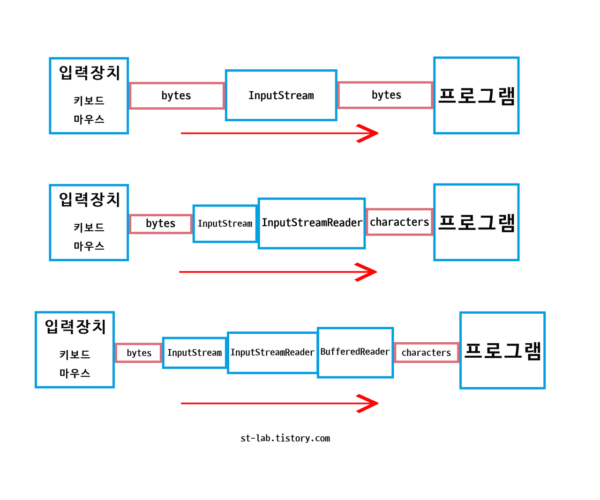

# be-w56-java-was
56주차 간단 웹 서버 구현

## 1단계 : **정적인 html 파일 응답**

> 22.01.24에 요구사항 구현을 하며 공부한 내용 정리
>

### InputStream 클래스

- 모든 종류의 byte InputStream의 superclass
    - data를 byte단위로 읽어 들이는 통로를 나타냄
    - [FileInputStream](https://docs.oracle.com/javase/7/docs/api/java/io/FileInputStream.html), [FilterInputStream](https://docs.oracle.com/javase/7/docs/api/java/io/FilterInputStream.html), [StringBufferInputStream](https://docs.oracle.com/javase/7/docs/api/java/io/StringBufferInputStream.html) 등을 포함
- 다음 행위가 가능함
    - `read` : 데이터 읽기
    - `reset` : 특정한 시점(mark해 둔 데이터)로 돌아가기
    - `available` : 통로에 얼마나 데이터가 남았는지 보여주기
    - `close` : 통로 끊기

### InputStreamReader 클래스

- 문자스트림 이라고도 하며 바이트를 읽어 `charset`을 통해 문자로 변환하는 작업을 수행
    - byte단위로 읽어들이는 InputStream을 이용해서 문자 단위로 읽음
    - char 배열로 데이터를 받을 수 있다

### BufferedReader 클래스

- 문자열을 읽기 위해 버퍼를 두고 한 번에 전송하는 스트림
    - 문자열을 읽으므로 문자를 읽어들이는 InputStreamReader를 이용해 생성됨
- `Scanner`와 달리 정규식을 검사하지 않고 그대로 읽기 때문에 성능이 좋음
    - Scanner의 경우 InputStreamReader을 통해 char 타입으로 데이터를 받고 입력 메소드( `next()`, `nextInt()` 등) 의 타입에 맞게 정규식을 검사한 후 `Pattern` 타입으로 변환하고 `String`으로 바꿔줌
    - Scanner는 위와 같이 변환 과정이 많기 때문에 성능이 떨어짐
- `BufferedReader.readLine()`
    - line 단위로 문자를 읽어서 String으로 반환하는 메소드

이 그림 한 장으로 위 내용이 다 설명되는 것 같다

