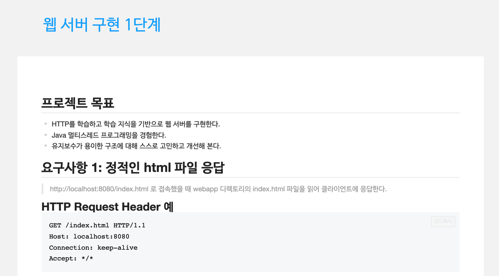

# be-w56-java-was
56주차 간단 웹 서버 구현

#Step1
## 요구사항
- Http를 학습한 후, 학습 내용을 기반으로 웹 서버 구현.
- 

## Issue
- css,js 가 깨지는 현상 발생.
    - 원인 : Content-type 을 항상 text/html 로 고정해서 넣어줘서 생기는 문제.
    - 해결 : apache tika 라이브러리를 사용하여 Content-type을 동적으로 생성하도록 변경.

## 구현 내용
- BufferedReader 를 이용하여 Request를 String 으로 입력받음.
- split을 이용하여 첫 줄의 입력을 통해 url path를 얻음.
- Response Body에 해당 path의 경로에 있는 파일을 byte 타입으로 가져와 flush.
- Junit 이용하여 Test 코드 생성.