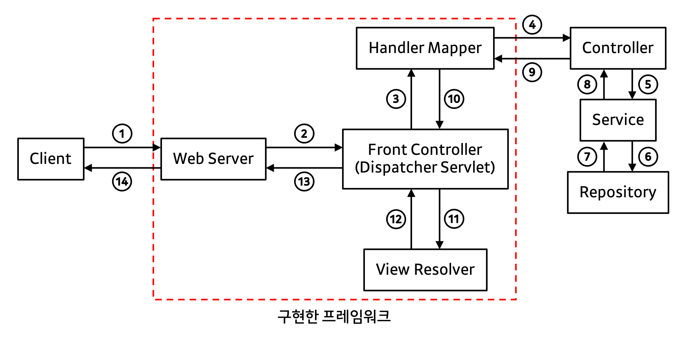

# be-w56-java-was
56주차 간단 웹 서버 구현
## 1단계 ([링크](https://lucas.codesquad.kr/2022-kakao/course/%EC%9B%B9%EB%B0%B1%EC%97%94%EB%93%9C/Java-Web-Server/%EC%9B%B9-%EC%84%9C%EB%B2%84-%EA%B5%AC%ED%98%84-1%EB%8B%A8%EA%B3%84))
### 프로젝트 목표
- HTTP를 학습하고 학습 지식을 기반으로 웹 서버를 구현한다.
- Java 멀티스레드 프로그래밍을 경험한다.
- 유지보수가 용이한 구조에 대해 스스로 고민하고 개선해 본다.
### 요구사항 1: 정적인 HTML 파일 응답
> http://localhost:8080/index.html 로 접속했을 때 webapp 디렉토리의 index.html 파일을 읽어 클라이언트에 응답한다.
#### HTTP Request Header 예
```
GET /index.html HTTP/1.1
Host: localhost:8080
Connection: keep-alive
Accept: */*
```
### 상세 구현사항
- Thread 기반으로 소켓 연결 구현
  - `ConnectionHandler`에서 `Thread` 상속, 새로운 소켓을 받아 요청 및 응답을 모두 처리
- 요청 및 응답을 처리하기 위한 Handler 구현
  - `RequestHandler`: 요청 헤더의 각 줄을 읽어들여 파싱
  - `ResponseHandler`: `RequestHandler`를 입력받아 알맞는 응답 헤더 및 몸체를 만들어서 반환
    - MIME: Apache Tika 활용 
    - HTTP 상태 코드: Apache HttpClient의 HttpStatus 인터페이스의 상수 값 활용
- 사용할 Util들을 직접 정의
  - `CommaSeries`: 요청 헤더의 내용 중 `,`로 구분이 되는 값을 갖는 정보를 담을 자료형
  - `Constants`: 상수 관리, 현재는 Context Path를 담아놓음
  - `ContentType`: 요청 헤더에서 Content-Type의 정보를 담을 자료형
  - `HttpRequestUtils`, `IOUtils`: 기존에 제공된 Utils, 파싱 관련 내용 포함

## 2 ~ 4단계
### 각 링크들
- [2단계](https://lucas.codesquad.kr/2022-kakao/course/%EC%9B%B9%EB%B0%B1%EC%97%94%EB%93%9C/Java-Web-Server/%EC%9B%B9-%EC%84%9C%EB%B2%84-%EA%B5%AC%ED%98%84-2%EB%8B%A8%EA%B3%84)
- [3단계](https://lucas.codesquad.kr/2022-kakao/course/%EC%9B%B9%EB%B0%B1%EC%97%94%EB%93%9C/Java-Web-Server/%EC%9B%B9-%EC%84%9C%EB%B2%84-%EA%B5%AC%ED%98%84-3%EB%8B%A8%EA%B3%84)
- [4단계](https://lucas.codesquad.kr/2022-kakao/course/%EC%9B%B9%EB%B0%B1%EC%97%94%EB%93%9C/Java-Web-Server/%EC%9B%B9-%EC%84%9C%EB%B2%84-%EA%B5%AC%ED%98%84-4%EB%8B%A8%EA%B3%84)
### 프로젝트 목표
- HTTP를 학습하고 학습 지식을 기반으로 웹 서버를 구현한다.
- Java 멀티스레드 프로그래밍을 경험한다.
- 유지보수가 용이한 구조에 대해 스스로 고민하고 개선해 본다.
### 요구사항
- 2단계: GET으로 회원가입 기능 구현
  - “회원가입” 메뉴를 클릭하면 `http://localhost:8080/user/form.html` 으로 이동하면서 회원가입 폼을 표시한다.
  - 이 폼을 통해서 회원가입을 할 수 있다.
  - 회원가입을 하면 다음과 같은 형태로 사용자가 입력한 값이 서버에 전달된다.
      ```
      /create?userId=javajigi&password=password&name=%EB%B0%95%EC%9E%AC%EC%84%B1&email=javajigi%40slipp.net
      ```
  - HTML과 URL을 비교해 보고 사용자가 입력한 값을 파싱해 User 클래스에 저장한다.
- 3단계: POST로 회원 가입 구현
  - `http://localhost:8080/user/form.html` 파일의 form 태그 method를 get에서 post로 수정한 후 회원가입 기능이 정상적으로 동작하도록 구현한다.
  - 가입 후 페이지 이동을 위해 redirection 기능을 구현한다.
- 4단계: Cookie를 이용한 로그인 구현
  - “로그인” 메뉴를 클릭하면 `http://localhost:8080/user/login.html` 으로 이동해 로그인할 수 있다. 로그인이 성공하면 `index.html`로 이동하고, 로그인이 실패하면 `/user/login_failed.html`로 이동해야 한다.
  - 앞에서 회원가입한 사용자로 로그인할 수 있어야 한다. 로그인이 성공하면 cookie를 활용해 로그인 상태를 유지할 수 있어야 한다. 로그인이 성공할 경우 요청 header의 Cookie header 값이 `logined=true`, 로그인이 실패하면 Cookie header 값이 `logined=false`로 전달되어야 한다.
### 상세 구현사항
#### < 목표 >
- Spring MVC 구조를 지향
- Reflection API와 Annotation 기반으로 Controller 클래스 및 메소드를 매핑
#### < 전체적인 흐름 설명 >

1. Client의 요청을 받음
2. Web Server는 열어둔 소켓에서 요청을 받아 Thread 생성
   - `HttpRequestHandler`, `HttpResponseHandler` 객체를 생성
   - `HttpRequestHandler`에서 모든 정보를 파싱
   - 해당 객체들은 Front Controller로 이동 후 받은 요청의 URI에 따라서 static file인지 Controller를 가야하는지 확인
3. Controller에 가야한다면 Handler Mapper로 `HttpRequestHandler`, `HttpResponseHandler`를 전달
4. Handler Mapper에서는 `@RequestMapping` 어노테이션이 붙은 Controller 클래스들을 확인
   - `@RequestMapping` 어노테이션이 붙은 Controller 클래스들 중 현재 URI에 맞는 Controller를 확인
   - 해당 Controller가 있다면 그 Controller 내의 메소드들 중 `@RequestMapping` 어노테이션이 붙은 메소드들 확인
   - 해당 메소드들 중 현재 요청에 맞는 메소드가 있다면 그 메소드를 실행
5. 현재 요청에 필요한 메소드를 `Service` 실행
6. `Repository`에서 필요한 데이터를 가져와야 한다면 해당 메소드 호출
7. 필요한 데이터를 반환
8. 비즈니스 로직 실행 후 데이터 반환
9. 처리된 데이터를 `String` 또는 `ModelView`로 반환
   - String의 경우, `redirect:`가 앞에 붙어서 반환되며 static page 파일 정보를 담아서 반환
10. Controller로부터 반환받은 값을 Front Controller에게 전달
    - 만약 `String`을 반환받았다면 ModelView를 만들어 전달
11. 받은 ModelView를 처리하기 위해 View Resolver에게 전달
    - Static file이거나 redirect일 경우 해당 파일을 찾아 반환
12. 필요한 정보를 담은 ModelView를 반환
13. 모든 정보가 담긴 `HttpResponseHandler`에서 그 정보들을 파싱하여 `flush` 호출
14. `flush`되어 Client에 응답을 보냄
### 실행 화면
<details>
    <summary>펼치기</summary>
    <h4>< 2단계: GET으로 회원가입 기능 구현  ></h4>
    
    <h4>< 3단계: POST로 회원가입 기능 구현  ></h4>
    
    <h4>< 4단계: Cookie를 이용한 로그인 구현  ></h4>
    
</details>