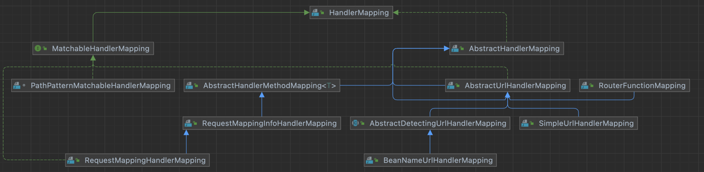

# be-w56-java-was
56주차 간단 웹 서버 구현

# TODO
- [X] Content Type 지원 개선
- [ ] 매직 리터럴 제거
- [ ] Handler 추상화 개선
    - 핸들러 매핑 과정
    - 핸들러 등록 과정
    - 핸들러 결과 유형(View Resolving, Templating, ResponseEntity)
    
- [ ] 전체적인 패키징 개선
    - Util 보다는 Rich Domain Model 사용하기
- [ ] 전역 기본 에러 핸들러 추가
- [ ] 2,3단계 기능 구현

# 2022.02.04(금)
## Code


## TIL(TMI)
logback설정에서 워닝이 뜨길래, logback을 좀 알아보고, build.gradle만지는 김에 build.gradle도 조금 파헤쳐봤다.  

### Logback
logback은 appender와 logger가 있고, appender가 일종의 adapter로 볼 수 있다. appender의 class속성을 기정의된 Appender로 적절하게 설정해주면
거기로 출력을 연결해주고 출력형식도 안에서 지정해줄 수 있다.  

logger와 특수한 logger인 root이 stream으로 보고 위에 정의한 appender를 장착해주면 된다.
정의한 logger는 코드에서 getLogger()를 통해서 가져와서 사용할 수 있다.  
logger에는 level이 있는데, 일종의 필터라고 보면 된다. logger의 다양한 level의 로깅 메소드를 호출할 때, 
logger의 상태 level에 따라 출력 여부(appender로 보낼지 말지) 여부가 결정된다.
level지정 안하면 상속하며, 최상위 logger인 root의 기본 레벨은 debug. 레벨은 Trace/Debug/Info/Warn/Error/Off가 있다.

logback은 core, classic, access세 개의 모듈이 있는데, core가 기반 프레임워크 제공하고, classic과 access 응용이라고 볼 수 있음.  
classic은 slf4j지원을 추가하고 좀 더 어플리케이션 지향적이고, access는 container(Servlet Container, 도커 컨테이너 아님)와 통합되어 Http 레이어?레벨?에 특화된 로깅 기능을 제공하는 것 같다.

근데 왠지 모르지만 maven repository에서 classic을 검색하면 기본이 testImplementaion으로 되어있다. 프로덕션에서는 다른 거 써야 되나...흠... 잘 모르겠다.

### Junit 5
build.gradle보니, junit관련 된 게 뭐가 잡다하게 많다. param은 정확한 용도가 기억나는데, 나머지, api와 engine은 어떤 차이인지 궁금해서 검색해봤다.  
api가 테스트를 작성하는 데 필요하고, engine이 실행하는 데 필요하다고 한다.  
@Test와 같은 어노테이션이나 assert같은 메소드가 Junit을 사용하는 인터페이스고 말그대로 api이고 코드 작성할 때 사용하고, 컴파일할 때 필요하다.  
engine이 실제 junit기능 구현이고 사용자의 코드에서는 이에 대한 직접 언급이 없으니(api로 잘 포장됨) 런타임에만 필요하다.

근데 5.4부터인가 api, engine, params를 다 포함하는 aggregator모듈 생겨서 이거만 의존성에 추가해주면 된다.

여기까지가 Junit Jupiter얘기고,  
JUnit 5 = JUnit Platform + JUnit Jupiter + JUnit Vintage라고 한다.
Vintage는 3,4를 위한 지원이니 제쳐두고 Platform은 Junit을 IDE같은 데서 잘 지원되게 하는 거 같다(사실 아닌 거 같은데 더 알아보기 지친다).
쨌든 이 Junit Platform을 쓰기 위해서 


### Class는 Type의 일종.
Type은 class거나, interface거나, array거나, primitive.

### 생각정리.
상시 접대하는 친구


# 2022.02.03(목)
## Code

## TIL
지난주 수목에 스프링 소스코드를 직접 보고 간이하게 클론코딩을 하기를 도모했는데, 핸들러 등록과 호출 부분은 진짜 소스코드가 눈 앞에 있어도 이해하지를 못했다.  
속력보다는 방향이 중요하지만, 혹은 유효 속도가 중요하다고 할 수 있는데, 현재 내 레벨에서는 이렇게 보는 게 너무 비효율적이다라는 생각이 들었다.  
지금까지 배운 것만이라도 일단 활용해서 아웃풋하는 시간을 가져보자.  
<br>
일단 핵심 목표는 확장 용이한 코드를 짜기를 연습하는 것. 그러기 위해서는 변하지 않는 인터페이스를 잘 뽑아내야 됨.  
스프링 프레임워크 자체가 웹 어플리케이션 개발에 있어서, 공통으로 필요한 기능을 뽑아서 만든 인터페이스라고 볼 수 있을 것 같다.
아주 많은 기능이 있는데, 그 중에서
1. 의존성 관리(싱글 인스턴스화하여 리소스 절약하고, 구현체 사이의 연결 고리를 완전히 인터페이스로 포장하여 진짜 OCP지키게 할 수 있게 함)
2. 다양한 컨트롤 매핑 방법(Http Request에 다양한 훅을 단 코드 몇 줄로 할 수 있게 함)

이 가장 눈에 들어온다.

둘 다 하면 좋겠지만, 일단 2번부터 해보자.  
2번을 잘 하기 위해서는, 핸들러를 등록하는 인터페이스(Annotation이든, xml이든, 그냥 프레임워크 소스코드를 수정하는 방식으로든)를 정의해야 되고,
핸들러의 처리 결과에 대한 인터페이스(무엇을 반환할지, 스프링에서는 뷰 리저빙을 디폴트로 하여 스트링을 반환하는 거처럼)를 정해야 된다.
핸들러 등록하는 목적은, 런타임에 핸들러 리저빙을 할 수 있기 위해서다.

프레이워크 부팅되면, 이니셔라이저가 핸들러 스캔을 한다.  
스캔된 핸들러를 분석해서, 런타임에 각 핸들러마다 핸들러 매칭 여부 결정하는 객체를 만든다.  
Http Request를 인자로 받고 Boolean을 반환하는 Predicate를 만들고, 순서 유지가 가능한 HandlerMap에 등록한다.  

이제 그 후에 요청이 올 때마다 이 HandlerMap을 순차적으로 조회하면서 첫번째로 부합하는 핸들러를 호출하면 된다.
그러면 등록 인터페이스는 핸들러 스캔너가 결정하네.


Method의 Parameter name을 런타임에 획득하는 것은 어렵다. 컴파일할 때 특정 옵션을 켜야하고 보안성을 저하시킨다.


# 2022.01.27
## Code
None yet

## TIL
### Spring 소스 코드 공부 정리
**요청 처리 흐름**

Jakarta의 HttpServlet를 상속한  
HttpServletBean을 상속한  
FrameworkServlet을 상속한  
DispatcherServlet

1. 요청이 들어오면 HttpServlet(Servlet)의 service를 호출할 것으로 기대됨.
2. Jakarta기본 구현에 따라 service콜은 따라 doXXX로 디스패칭함.  
3. 하지만 FrameworkServlet에서 각 doXXX를 공통적으로 processRequest을 호출하기 때문에,  
   결과적으로 모든 요청은 processRequest에 도착함.  
4. processRequest에서는 추상 메소드 doService를 호출함.
5. 이를 구현한 DispatcherServlet의 doService는 request에 다양한 컨텍스트 정보를 추가하고 doDispatch를 호출함.
6. doDispatch에서 getHandler를 통해 request에 맞는 핸들러를 가져오고,    
   이 getHandlerAdapter를 통해 해당되는 HandlerAdapter를 가져와서,  
   HandlerAdapter의 handle()를 통해 실질적인 요청 핸들링을 진행하고,  
   모델앤뷰를 선택적으로 반환함.
   > HandlerAdapter를 통해서 Handler에 request 핸들링을 맡김으로,  
   > Handler자체의 인터페이스는 굉장히 다양하게 설계할 수 있으면서도,  
   > HandlerAdapter가 이를 잘 포장함으로,  
   > doDispatch쪽에서는 굉장히 안정적인 인터페이스를 가진 HandlerAdapter만 마주하여,   
   > 다양한 인터페이스의 Handler를 동일하고 간소한 HandlerAdapter의 인터페이스를 통해서 호출할 수 있음.   
   > 구체적으로, HandlerAdapter는 handle(HttpServletRequest, HttpServletResponse, Object)메소드를 제공해야 됨.
7. doDispatch에서 마지막으로 processDispatchResult에 요청, 응답, 핸들러, 모델앤뷰, 발생한 예외를 담아서 호출함.     
   핸들러, 모델앤뷰, 발생한 예외는 Null일 수 있음.
8. processDispatchResult에서 모델앤뷰가 존재하지 않다면 추가 작업 진행하지 않고,  
   processRequest에서 publishRequestHandledEvent를 통해 프레임워크에 메시지를 공유하고,  
   요청 처리(HttpServlet/Servlet의 Service콜)을 마무리함. 
9. processDispatchResult에서 모델앤뷰가 존재한다면 render를 호출함. 
10. render는 뷰 오브젝트를 resolve하고(되어 있지 않다면) 해당 뷰 오브젝트의 render의 호출하여 렌더링 과정을 위임함.
11. 뭔가 이후부터는 Spring이 정의한 규격에 맞는 View를 정의한 Template 라이브러리가 바통터치해서 진행할 거 같음


**핸들러 등록 과정**

역순으로
1. DispatcherServlet에서 getHandler는  
   인스턴스 변수인 handlerMappings에서 각 HandlerMapping에 대해서  
   getHandler를 호출하여 매칭하는 핸들러가 있는지 확인하고,  
   첫 매칭된 핸들러를 반환함.

MatchableHandlerMapping은 비교적 최근에 도입되고 구현이 PathPatternMatchableHandlerMapping밖에 없다.
PathPatternMatchableHandlerMapping은 무슨 Introspector에서 생성된다... 잘 모르겠다...
으.. 어렵다..


# 2022.01.26
## Code
- Content Type 지원 개선
  - Apache Tika 라이브러리 적용
  - 소요 시간 테스트(최대 10ms)
  - HttpRequest도메인 기능 확대
- 매직 리터럴 일부 제거
- [스프링의 관련 소스코드 읽기](https://github.com/spring-projects/spring-framework/blob/3600644ed1776dce35c4a42d74799a90b90e359e/spring-webmvc/src/main/java/org/springframework/web/servlet/mvc/method/annotation/RequestMappingHandlerMapping.java)

## TIL
- 쿼리 Selectivity에 따라서 쿼리 옵티마이저가 index의 활용여부를 결정한다
- 한번에 한 인덱스만 적용 가능하고, 대신 복합 인덱스 존재하고 순서 중요함


# 2022.01.25 TIL
### Socket.InputStream을 close하면, Socket도 close된다.
따라서 다음과 같이 작성할 수 없다
```java
try (in = socket.getIn()) {
    ...
} catch ...

try (out = socket.getOut()) {
   ...
} catch ...
```

### Lambda에서는 Exception처리가 안 된다.
따라서 다음과 같은 Wrapper function을 만들어야 한다
```java
void methodInQuestion() throw SomeException {
    ...
}

void wrappedMethodInQuestion(){
     try {
        methodInQuestion();
     } catch(SomeException e)...
}
```
   


# 2022.01.24 TIL
## 잡다한 거
1. BufferedInputStream vs InputStream
   1. [SO BufferedInputStream vs InputStream](https://stackoverflow.com/questions/9805192/the-difference-of-inputstream-datainputstream-and-bufferedinputstream-in#:~:text=DataInputStream%20is%20a%20kind%20of,reduces%20disk%20or%20network%20access.)
   2. [SO Always prefer BufferedInputStream?](https://stackoverflow.com/questions/2964044/should-i-always-wrap-an-inputstream-as-bufferedinputstream)
   3. 내 결론: 문제 생길때까지 무지성 BufferedInputStream
2. Intellij에서 "// TODO"는 하이라이트 된다

## 프로젝트에 대한 이해

- 목적: WAS구현

자료조사 좀 하고, 제가 이해한 거를 한번 적어봤습니다.
아마 틀린 게 꽤 많은텐데, 이렇게 적으면 피드백 받을 수 있으니 너무 좋네요.

<br>

### WAS란
WAS는 Dynamic한 Contents를 서빙한다는 점에서 Web Server와 구별된다.

<br>

Dynamic contents를 요청하는 것도, 결과적으로 그냥 HTTP Request다.

Nginx같은 Web Server가 앞단에서, Reverse proxy 역할도 해주고, 보안 이슈도 좀 챙겨주고, 동적인 결과를 가져와야 되는 HTTP Request를 필요하면 수정도 좀 하고, WAS로 흘려보낸다.

<br>

WAS는 Java에서는 Tomcat, Python에서는 Gunicorn같은 게 해당되는 거 같다.

Tomcat, gunicorn의 핵심 역할은 Dispatcher인 거 같다.
(근데 다시 찾아보니 Dispatcher Serverlet은 스프링에 속하는 거 같다. 사실 WAS의 역할을 잘 모르겠다. HTTP Request 파싱 및 의미적 해석이 핵심일 수도 있겠다)

### 프레임워크와의 관계
이 Dispatcher에 그냥 수동으로 코드를 집어 넣을 수도 있겠지만,
Webframework를 사용해서(특히 컨트롤러 매핑), Dispatcher의 구현과 애플리케이션 로직을 분리하고,
웹 애플리케이션이 흔히 필요하는 기능들을 쉽게 구현, 유지보수할 수 있는 거 같다.

### WAS 구현 고민
돌아와서, 우리가 구현하고자 하는 WAS인데,
그럼 WAS를 구현을 상식적으로 생각해보면
1. HTTP Request Parsing
   1. Request Line:
      1. 메소드: GET/POST/PUT/DELETE만이라도 해보면 좋을 듯.
      2. URL: 리소스와 쿼리 스트링 발라내기.   
      3. HTTP버전: 버전은 1.1이나 2로 하드코딩해야 될 한데, 2가 좀 더 구현이 어려울 거 같은데, 1.1도 최소 스펙 맞추긴 어려울 거 같아서 큰 의미 없을 듯.
   2. Request Header:
      - HTTP스펙에 따라서 다양한 헤더와 그에 따른 기능이 있겠는데, 가능하면 그 기능들을 OCP 원칙에 따라서 구현할 수 있는 기반/틀을 구현하면 참 좋겠다
2. URL Dispatcher
   - 일단은 정말 단순하게 구현하기. Regex를 LinkedHashMap에 키로 넣어서, 요청 올 때마다 순차적으로 매칭시켜서, 값에 있는 함수변수에 URL을 잘 쪼개서 전달해서 호출하기
3. 쿠키를 비롯한 Request Header에서 나오는 다양한 기능들...
   - 일단 스킵
4. Response만들기
   1. Dispatcher에 등록한 핸들러에서 무엇이 돌아올지 먼저 정해야 된다.
   2. 스프링에서는 View Resolver가 컨트롤러에 반환 값을 읽고 뷰 파일을 잘 만들고, 이 생성된 뷰 파일을 Tomcat에 주거나, 그냥 Response Entity를 줘서
      이 Entity Object가 json으로 serialize되는 거 같다. 근데 여기서도 지금 Tomcat과 Spring의 경계선에 대한 인지가 조금 모호한 거 같다
   3. Dispatcher에 등록된 핸들러에서 우리가 구현하고자하는 WAS에서 제공하는 유틸함수(request.뭐시기)를 통해서 Response Header를 일부 지정할 수 있겠지만, 
      쨌든 WAS에서 마지막 기본값으로 설정해줘야 될 Response Header설정하기
   4. 뷰 파일이든, Json이든 Response body에 바이트로 잘 넣어놓기

### 오늘내일 해 볼 것
1. GET/POST, Query String, "View주소를 돌려주고 모델을 받아서 템플릿 값을 채우는 핸들러" 등록을 지원하는 WAS 구현해보기
2. Tomcat 구현 쉽게 설명하는 글 찾아보기, Tomcat과 Spring 정확한 경계선 및 역할 알아보기 
