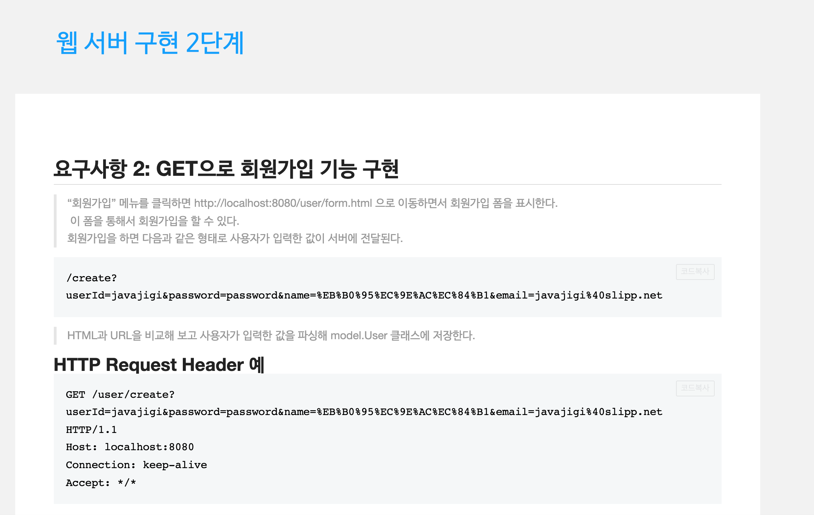
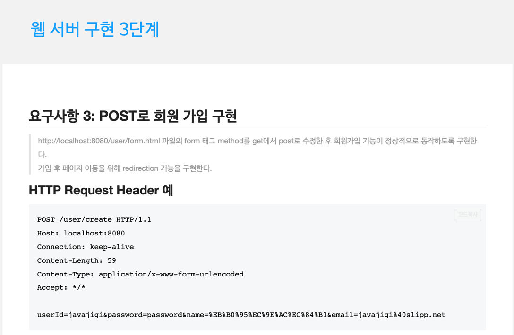
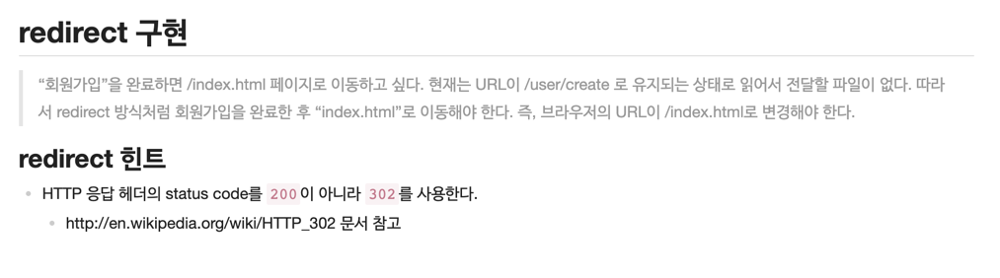

# be-w56-java-was
56주차 간단 웹 서버 구현

### 실행방법
서버 실행 후, http://localhost:8080/index.html 로 이동

# Step1
## 요구사항
- Http를 학습한 후, 학습 내용을 기반으로 웹 서버 구현.
- 

## Issue
- css,js 가 깨지는 현상 발생.
    - 원인 : Content-type 을 항상 text/html 로 고정해서 넣어줘서 생기는 문제.
    - 해결 : apache tika 라이브러리를 사용하여 Content-type을 동적으로 생성하도록 변경.

## 구현 내용
- BufferedReader 를 이용하여 Request를 String 으로 입력받음.
- split을 이용하여 첫 줄의 입력을 통해 url path를 얻음.
- Response Body에 해당 path의 경로에 있는 파일을 byte 타입으로 가져와 flush.
- Junit 이용하여 Test 코드 생성.

# Step2
## 요구사항
- "회원가입" 메뉴를 클릭하여 회원가입 폼으로 이동.
- 회원가입 폼에서 입력한 정보를 파싱하여 user 클래스에 저장.
- GET 으로 회원가입 기능을 구현.
- 

## 구현내용
- HandlerMapping 클래스를 만들어 각 URL에서 사용해야하는 클래스와 메소드를 확인하여 실행.
- Request Method 가 GET 인 경우 url 을 파싱하여 HashMap 으로 만들도록 생성.
- Controller interface 를 만들어 사용.
- UserController 는 Controller interface 를 상속.
- UserController, UserService, DataBase 클래스 생성.

# Step3
## 요구사항
- POST 로 회원가입 기능을 구현.
- redirect 구현.
- 
- 

## 구현내용
- HttpRequest의 parsing 함수들을 separator 와, keyValueSeparator 를 입력으로 받도록 변경.
- 이를 통해 HttpRequestHeader 에서 Content-Length 값을 얻어오는 함수 생성. 
- HTTP Method가 POST 인 경우 httpRequestBody 를 parsing 해서 HashMap으로 만들도록 생성.
- RedirectPair 클래스를 만들어서, Redirect 여부와 url을 같이 전달.
- 각 url 에 대해 redirect 여부를 redirectSet 에 넣어서 알 수 있도록 생성.
- Enum 을 이용하여, Status code, Status Message 를 저장하는 Status 생성.
- Lombok 이용
- User 생성 시, userId 가 이미 존재하는 경우 Exception 발생하는 내용 추가.
- IllegalCreateUserException 발생 시, 해당 Message 를 웹 페이지에 출력.