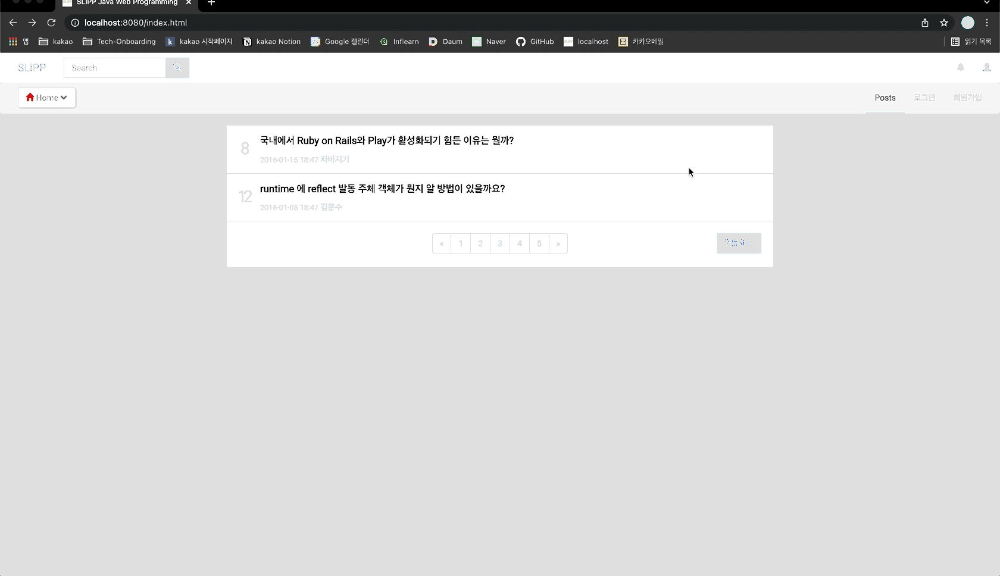
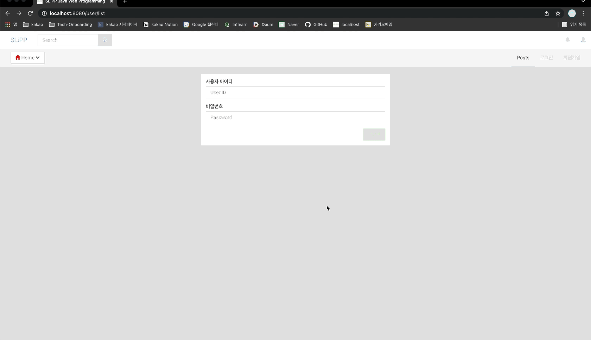
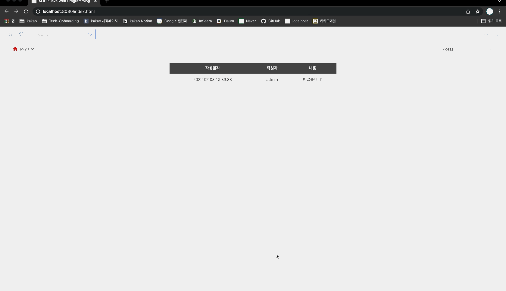
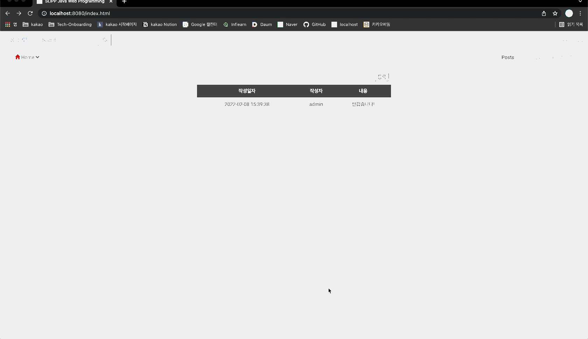

# be-w56-java-was
56주차 간단 웹 서버 구현

## [1 ~ 4단계](docs/README_STEP1~4.md)

## 의존성 주입 추가 구현
### 상세 구현사항
- `@Component`, `@Bean`, `@Autowired`, `@Primary` 어노테이션 정의
- `Container` 클래스 정의 및 의존성 주입을 위한 기능 구현
- 먼저 생성자 또는 메소드를 저장 (`EXECUTABLES`)
    - `@Component`가 붙은 클래스에서 생성자를 가져와 해당 클래스, 구현한 인터페이스를 key로 지정하여 저장
      - 정의한 생성자가 없을 경우, 디폴트 생성자를 가져옴
      - 정의한 생성자가 1개만 있는 경우, 해당 생성자를 가져옴
      - 정의한 생성자가 여러 개인 경우, `@Primary`가 붙은 생성자를 가져옴
    - `@Bean`이 붙은 메소드를 가져와 해당 메소드의 반환 타입을 key로 지정하여 저장
- 저장한 생성자들과 메소드들을 모두 반복 실행하여 반환된 객체들을 저장 (`CONTAINER`)
    - 만약 매개변수를 받는 생성자 또는 메소드일 경우, `@Autowired`가 붙었는지 먼저 확인 후 해당 인자들을 `CONTAINER`에서 찾아줌
    - `EXECUTABLES`와 `CONTAINER`의 크기가 같아질 때까지 반복
- Handler Mapper에서 Controller를 지정해줄 때, `CONTAINER`에서 해당 Controller의 객체를 가져옴

## 5, 6단계
### 각 링크들
- [5단계](https://lucas.codesquad.kr/2022-kakao/course/%EC%9B%B9%EB%B0%B1%EC%97%94%EB%93%9C/Java-Web-Server-2/%EC%9B%B9-%EC%84%9C%EB%B2%84-%EA%B5%AC%ED%98%84-5%EB%8B%A8%EA%B3%84)
- [6단계](https://lucas.codesquad.kr/2022-kakao/course/%EC%9B%B9%EB%B0%B1%EC%97%94%EB%93%9C/Java-Web-Server-2/%EC%9E%90%EB%B0%94-%EC%9B%B9-%EC%84%9C%EB%B2%84-%EA%B5%AC%ED%98%84-6%EB%8B%A8%EA%B3%84)
### 요구사항
- 5단계: 동적 HTML 처리
    - 접근하고 있는 사용자가 “로그인” 상태일 경우 `http://localhost:8080/user/list` 에서 사용자 목록을 출력한다.
    - 만약 로그인하지 않은 상태라면 로그인 페이지로 이동한다.
- 6단계: Stylesheet 파일 지원 (이미 이전 단계에서 구현)
    - 지금까지 구현한 소스 코드는 Stylesheet 파일을 지원하지 못하고 있다. Stylesheet 파일을 지원하도록 구현하도록 한다.
### 상세 구현사항
- 동적 HTML 처리를 위한 Mustache (= `{{ ... }}`) 처리 로직 구현
  - ModelView 내에서 HTML 내용을 읽을 때 `MustacheResolver` 클래스를 활용
  - Mustache의 종류에 따라 내부 값을 ModelView의 Attribute에서 가져와서 처리
    - `{{# ... }}` ~ `{{/ ... }}`
      - Attribute가 List형 객체일 경우, 반복문을 돌도록 지정
      - List형 객체가 아닐 경우, Attribute가 존재한다면 해당 Attribute의 Scope로 지정하여 출력
    - `{{^ ... }}` ~ `{{/ ... }}`
      - Attribute가 존재하지 않는다면 해당 부분의 출력
    - `{{> ... }}`
      - Template로 간주하여 내부 값을 이름으로 갖는 파일을 불러와서 사용 
- 좀 더 간편한 로그인 표현을 위해 Session 구현
  - `HttpSessionHandler` 클래스를 정의하여 Session들을 관리
  - `ConcurrentHashMap` 형 객체에 Session ID를 지정하여 `HttpSession` 객체들을 저장
  - Session ID는 `UUID`를 활용하여 생성
  - Client가 Session ID가 없는 경우, Session ID를 만들고 `HttpSession` 객체를 만들어 저장
  - Client가 Session ID는 있지만 저장된 Session이 없는 경우, 다시 `HttpSession` 객체를 만들어 저장
  - ModelView의 Attribute에 Session 내용을 같이 저장할 수 있도록 구현
### 실행 화면

    
펼치기

    <h4>< 로그인 전, 후 화면 ></h4>
    
    <h4>< 로그아웃 후 회원가입, 회원 목록 조회 실패 ></h4>
    
    <h4>< 로그인 후 회원 목록 확인 ></h4>
    

## 7단계 ([링크](https://lucas.codesquad.kr/2022-kakao/course/%EC%9B%B9%EB%B0%B1%EC%97%94%EB%93%9C/Java-Web-Server-2/%EC%9E%90%EB%B0%94-%EC%9B%B9-%EC%84%9C%EB%B2%84-7%EB%8B%A8%EA%B3%84))
### 요구사항: 데이터베이스 연동 및 한 줄 메모장 구현
- H2 또는 MySQL 혹은 NoSQL 등 데이터베이스를 활용하여 회원정보를 DB에 저장한다.
- index.html에 로그인한 사용자가 글을 쓸 수 있는 한 줄 메모장을 구현한다.
- 로그인하지 않은 사용자도 게시글을 볼 수 있다.
### 상세 구현사항
- `DbConfig` 클래스에서 현재 Krane의 인스턴스에 설치돼있는 MySQL 서버에 연결하기 위한 `DataSource`형 객체 Bean 등록
  - DataSource를 사용하기 전에 Schema와 Data를 초기화해주기 위해 MyBatis 라이브러리에서 ScriptRunner를 통해 SQL 파일 미리 실행
- `UserRepository`와 `MemoRepository`를 JDBC를 통해 구현 (`UserRepositoryJdbcImpl`, `MemoRepositoryJdbcImpl`)
- 비동기통신 관련 구현
  - `@ResponseBody` 어노테이션 정의 
  - JSON 형태로 변환을 용이하게 하기 위해 Jackson 라이브러리 활용
  - `ModelView` 클래스 내에 flag (`isResponseBody`)를 정의하여 활용
  - `ModelView`형 객체를 활용하는 메소드에 `@ResponseBody` 어노테이션이 붙어있다면 flag를 `true`로 지정
  - 만약 해당 flag가 `true`면 JSON 형태의 `String`을 응답의 Body에 넣어 Client에 전달
- `index.html` 수정
  - 기존에 표시되던 게시글 템플릿 삭제
  - 한 줄 메모장 구현, 글 등록은 로그인한 사용자에게만 보이도록 함
  - `index.js`에서 비동기통신을 통해 전체 메모 데이터를 가져오거나 메모를 등록하도록 함
### 실행 화면

    
펼치기

    <h4>< 로그인 전, 후 화면 표시 변경 ></h4>
    
    <h4>< 메모 등록 ></h4>
    
    <h4>< 다른 아이디로 로그인 후 메모 등록 ></h4>
    

